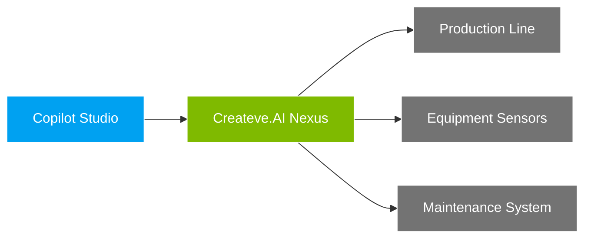
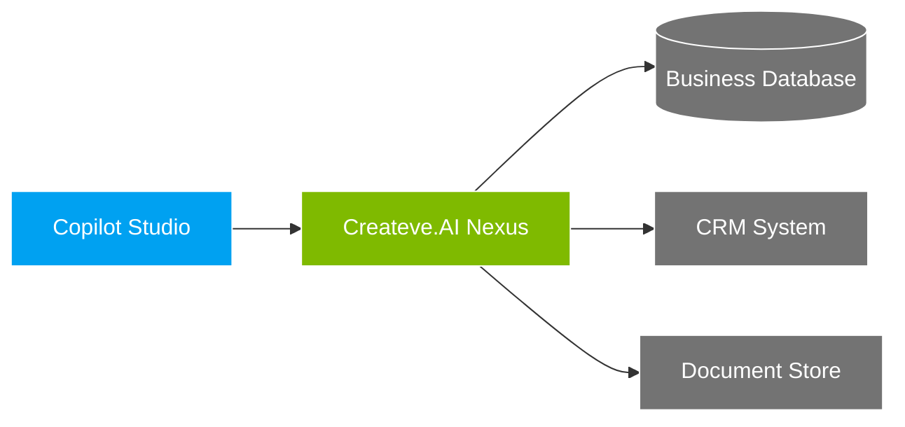
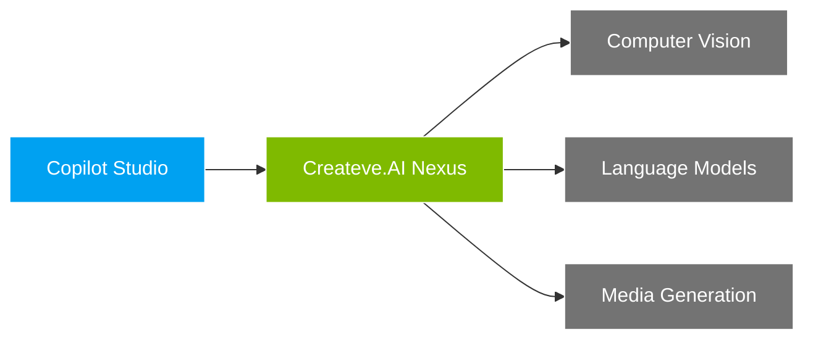

# Createve.AI Nexus: Enabling Real-World AI Agent Deployment 🚀

**The Open-Source Bridge Between AI Agents and Enterprise Systems - Unlock Your Organization's Data and Capabilities**

In today's AI landscape, the greatest challenge isn't the AI models themselves—it's connecting them to real-world data and systems. The Model Context Protocol (MCP) solves this by providing a universal standard for AI systems to securely access data and capabilities. Createve.AI Nexus, an open-source solution from RootUK, implements this standard to bridge AI agents with your enterprise systems, making deployment simple and scalable.

> 📢 **Preview Feature Notice**: MCP support in Microsoft Copilot Studio is currently in preview. Early adopters can start building their integration today to be ready when the feature becomes generally available.

Connect your AI agents to:
- Line-of-business applications through secure Private Link connections
- Real-time manufacturing and sensor data
- Document management systems and knowledge bases
- Custom AI models and processing pipelines
- Internal workflow automation systems

**Why Choose Createve.AI Nexus?** ✨

* **Universal AI Agent Integration:** 🤖
  - Native support for Microsoft Copilot Studio via MCP (Preview) ([Learn more](https://www.microsoft.com/en-us/microsoft-copilot/blog/copilot-studio/introducing-model-context-protocol-mcp-in-copilot-studio-simplified-integration-with-ai-apps-and-agents/))
  - Built-in compatibility with Anthropic's Claude via desktop app ([MCP details](https://www.anthropic.com/news/model-context-protocol))
  - Works with any MCP-enabled client or AI agent
  - OpenAPI support for platforms like [Dify](https://github.com/langgenius/dify)

* **Enterprise-Ready Architecture:** 🏢
  - Deploy in Azure with built-in support for Private Link
  - Key Vault integration for secure secrets management
  - Azure AD integration for enterprise identity
  - Comprehensive security controls

* **Real-Time Data Access:** ⚡
  - Stream sensor data and metrics
  - Monitor production systems
  - Access live business data
  - Real-time analytics integration

* **Secure System Integration:** 🔒
  - Role-based access control
  - Audit logging and monitoring
  - Data encryption in transit and at rest
  - Granular permission management

**Real-World Deployment Examples:** 🌟

1. **Manufacturing Intelligence** *(Copilot Studio MCP integration in preview)*

2. **Enterprise Data Integration** *(Copilot Studio MCP integration in preview)*

3. **AI Model Orchestration** *(Copilot Studio MCP integration in preview)*

**Understanding MCP (Model Context Protocol)** 🔗

MCP is an open standard that solves a critical challenge in AI deployment: connecting AI systems to real-world data and capabilities. Instead of building custom integrations for every data source, MCP provides:

- **Universal Connectivity:** A single protocol for all data sources
- **Two-Way Communication:** AI systems can both read and act on data
- **Dynamic Discovery:** AI agents automatically learn available capabilities
- **Security First:** Built-in security and access control
- **Real-Time Updates:** Live data and streaming support

Createve.AI Nexus implements MCP to make your data and systems accessible to any MCP-enabled AI agent, while also providing OpenAPI compatibility for traditional integration patterns.

**Key Features:** 💫

* **AI Agent Integration:** 🤝
  - Native MCP support for seamless agent connectivity
  - Real-time data synchronization
  - Automatic tool discovery and updates
  - Support for all major AI platforms

* **Enterprise Security:** 🛡️
  - Azure Private Link integration
  - Key Vault secret management
  - API key authentication
  - Granular access control

* **System Integration:** 🔄
  - Universal database connectivity
  - Real-time data streaming
  - Event-driven architecture
  - Message queue support

* **Development Framework:** 👨‍💻
  - Modular API architecture
  - Dynamic endpoint loading
  - Comprehensive monitoring
  - Docker containerization

* **Processing Capabilities:** ⚙️
  - Long-running job management
  - Auto-scaling support
  - State persistence
  - Error recovery

**Documentation:** 📚

Comprehensive documentation is available in the `docs` directory:

* [Setup Guide](docs/setup.md) - Installation and configuration
* [Configuration Guide](docs/configuration.md) - Detailed configuration options
* [Quick Start: Custom Integrations](docs/quick-start-integration.md) - Create your first integration
* [Architecture Overview](docs/architecture.md) - System architecture and components
* [Custom API Guide](docs/custom-api-guide.md) - Advanced integration development
* [API Usage Guide](docs/api-usage.md) - REST API documentation
* [MCP Integration Guide](docs/mcp-integration.md) - Detailed MCP implementation
* [Azure Reference Architecture](docs/azure-reference-architecture.md) - Enterprise deployment patterns
* [n8n Nodes](docs/n8n-nodes.md) - Workflow automation integration

**Expert Integration Services** 💼

Need help deploying Createve.AI Nexus in your organization? [RootUK](http://rootuk.com) provides enterprise consulting services:

* **Architecture Design:** Plan your integration strategy
* **Custom Development:** Build specialized connectors
* **Deployment Support:** Ensure successful implementation
* **Security Review:** Validate your security model

Contact RootUK to discuss your enterprise AI integration needs.

**License:** ⚖️

This project is licensed under the [Apache License v2](LICENSE)
