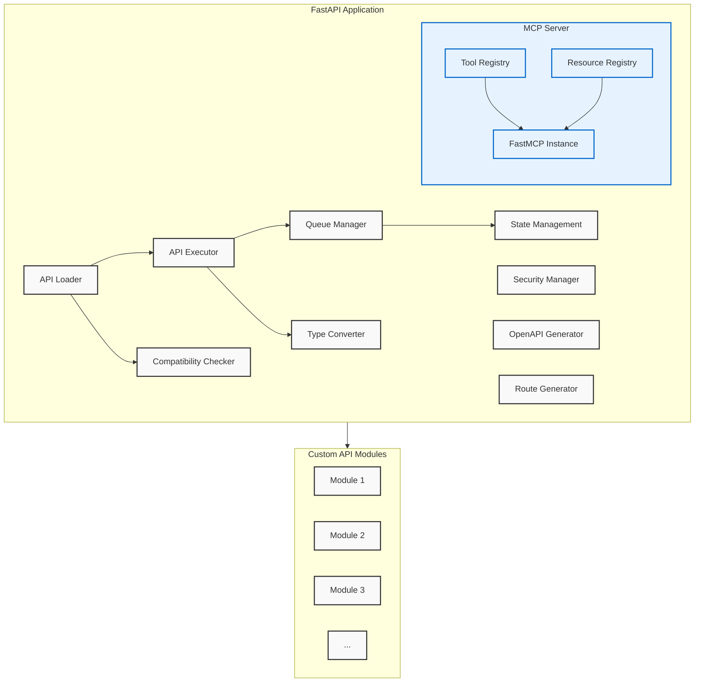
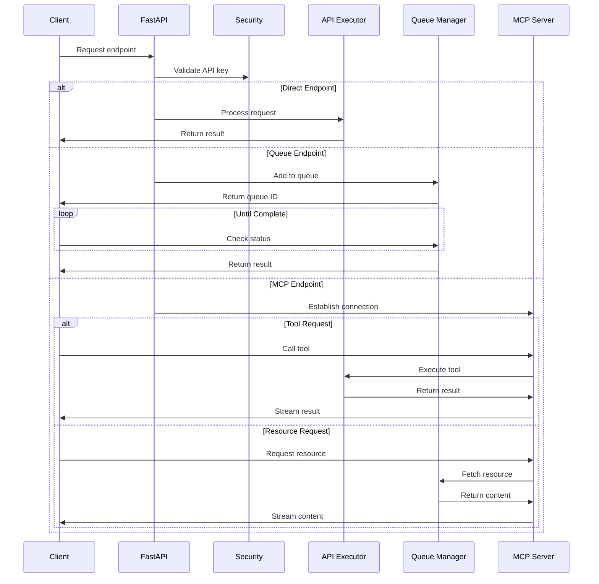
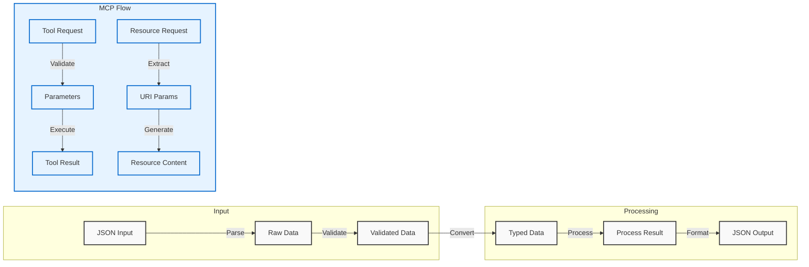
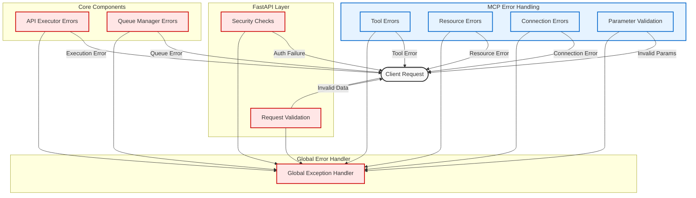

# Createve.AI API Server Architecture

This document provides an overview of the architecture of the Createve.AI API Server.

## Overall Architecture

The Createve.AI API Server is designed as a modular FastAPI application that dynamically loads and serves Python modules as REST API endpoints. It follows a service-oriented architecture with clear separation of concerns:

## Core Components

### API Loader

The API loader is responsible for dynamically loading Python modules from the configured `apis_dir` directory. It:

- Scans for Python files and packages
- Imports the modules and processes their class definitions
- Checks compatibility with the API server
- Installs any required dependencies specified in `requirements.txt` files
- Monitors files for changes and triggers reloading when needed

### API Executor

The API executor handles the execution of API endpoints:

- Creates instances of API classes
- Processes input data and converts it to the expected types
- Executes the appropriate methods on the API classes
- Processes and converts the output data to the correct format
- Handles errors and exceptions

### Queue Manager

The queue manager handles long-running API requests:

- Maintains a queue of requests to be processed
- Assigns worker tasks to process queue items
- Manages the state of queue items
- Provides endpoints for checking queue status
- Persists queue state to disk for recovery after restart

### Security Manager

The security manager handles authentication and authorization:

- Validates API keys from the request headers
- Enforces API key-based access control
- Handles security-related error responses
- Protects API endpoints from unauthorized access

### Route Generator

The route generator creates FastAPI routes for the API endpoints:

- Creates POST routes for API endpoints
- Creates POST routes for queue status endpoints
- Handles request validation
- Maps requests to the appropriate API executor and queue manager methods

### OpenAPI Generator

The OpenAPI generator creates OpenAPI documentation for the API endpoints:

- Generates OpenAPI schemas for API inputs and outputs
- Creates documentation for API endpoints
- Provides Swagger UI for interactive API exploration

### MCP Server

The Model Context Protocol (MCP) server provides a standardized interface for AI model interactions:

- Exposes tools and resources through a unified protocol
- Uses FastMCP for protocol implementation
- Provides WebSocket and SSE endpoints for real-time communication

#### Tool Registry

The Tool Registry manages MCP tools:

- Registers tool functions with clean parameter interfaces
- Manages tool execution and error handling
- Maintains separation between interface and implementation logic
- Integrates with API Executor for actual API calls

#### Resource Registry

The Resource Registry manages MCP resources:

- Registers resource handlers with URI template support
- Manages resource access and content delivery
- Maintains clean separation between URI parameters and context
- Integrates with Queue Manager for resource state

## Request Flow

## Data Flow

### MCP Data Flow

1. MCP requests are received through WebSocket or SSE connections
2. For tools:
   - Parameters are validated against tool definitions
   - Implementation functions process the parameters
   - Results are formatted according to MCP protocol
3. For resources:
   - URI parameters are extracted and validated
   - Implementation functions generate resource content
   - Content is streamed through the established connection

## Error Handling

The error handling system operates at multiple levels:

- FastAPI validation errors for request data
- API executor errors for API-specific errors
- Queue manager errors for queue-related errors
- Security manager errors for authentication errors
- MCP-specific error handling:
  - Tool parameter validation errors
  - Resource URI template matching errors
  - Implementation function errors
  - WebSocket/SSE connection errors
- Global error handler for unhandled exceptions

## Persistence

The API server persists several types of data:

- Queue state is saved to a JSON file
- Temporary files are stored in a configured directory
- Logs are stored in a configured file or streamed to the console

## Extensibility

The API server is designed to be extensible:

- New API modules can be added without modifying the core code
- The core components can be extended or replaced as needed
- The configuration can be customized for different deployment scenarios
- MCP extensibility:
  - New tools can be added by implementing tool functions
  - New resources can be added by implementing resource handlers
  - Custom tool and resource registries can be implemented
  - FastMCP instance can be configured with custom settings
