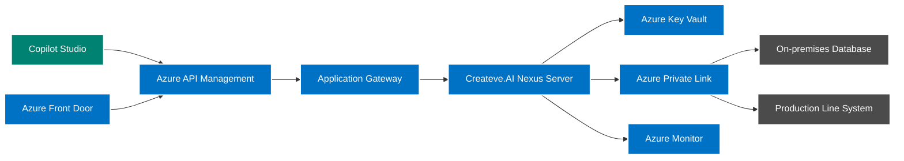
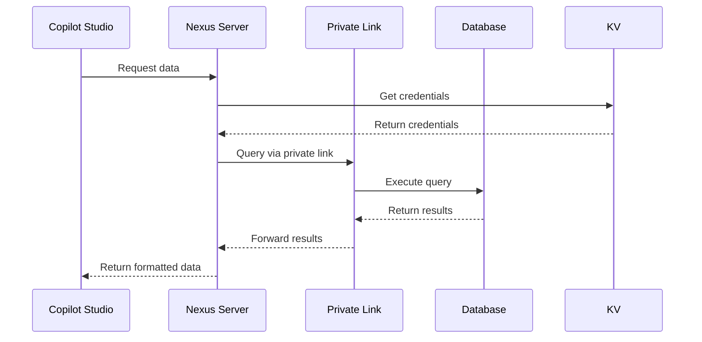
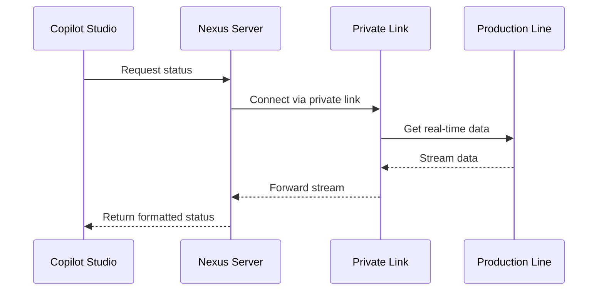
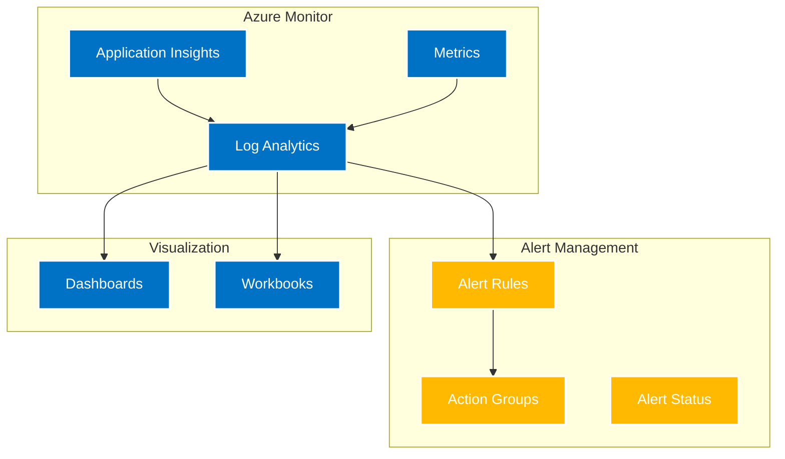

# Azure Reference Architecture for Copilot Studio Integration

This guide provides a reference architecture for integrating Createve.AI Nexus Server with Microsoft Copilot Studio in an Azure environment, including secure connections to on-premises systems.

## Overview

The reference architecture describes a production-grade deployment of Createve.AI Nexus Server in Azure, providing secure connectivity from Microsoft Copilot Studio (in Microsoft 365) to on-premises systems. The architecture includes examples of custom APIs that connect to an on-premises database and a real-time manufacturing production line system.

## Architecture Diagram



## Key Components

### 1. Azure API Management
- Primary entry point for Copilot Studio requests
- IP filtering to allow only Copilot Studio networks
- API key validation and rate limiting
- HTTPS/WSS termination
- Request routing to Application Gateway
- **SKU Recommendation**: Premium tier for production workloads, Developer/Basic for non-production

### 2. Application Gateway
- Layer 7 load balancing
- SSL/TLS termination for internal traffic
- Web Application Firewall (WAF)
- URL-based routing
- Health monitoring
- **SKU Recommendation**: Standard_v2 or WAF_v2 for production, Standard for non-production

### 3. Createve.AI Nexus Server
- Deployed in Azure Kubernetes Service (AKS) or Azure Container Apps, or Azure Container Instances (ACI)
- Custom APIs implemented as microservices
- Managed identities for Azure service authentication
- Horizontal scaling based on load
- **SKU Recommendation (AKS)**: Standard or Premium tier, depending on workload size. Use node pools for scaling.
- **SKU Recommendation (Container Apps)**: Consumption + Dedicated plan for cost-effectiveness with scaling.
- **Deployment Options**: Deploying to Azure Container Instances (ACI) provides a serverless option suitable for smaller workloads or development/testing.
- **Multiple Instances**: The architecture supports multiple Createve.AI Nexus Server instances, allowing for specialized configurations (e.g., one instance with GPU access, another with Private Link access to legacy applications). Each Copilot Studio agent can be configured to use a specific instance based on its requirements.

### 4. Azure Private Link
- Secure connection to on-premises network
- Azure ExpressRoute or Site-to-Site VPN
- Private connectivity to database and production systems
- Network isolation and security
- **SKU Recommendation**: Basic for dev/test, Standard or Premium for production environments based on bandwidth needs.

### 5. Azure Front Door
- Global load balancing
- DDoS protection
- SSL/TLS termination at the edge
- Custom routing rules
- Health probes

### 6. Azure Key Vault
- API key storage
- Certificate management
- Database credentials
- Connection string security
- **SKU Recommendation**: Standard tier for most use cases, Premium for high-security requirements

### 7. Azure Monitor
- Application Insights integration
- Log Analytics workspace
- Custom dashboards
- Alerting and notifications

## Security Considerations

### Network Security
```mermaid
graph TB
    subgraph Internet
        CS[Copilot Studio]
    end
    
    subgraph Azure
        subgraph "Security Perimeter"
            APIM[API Management]
            AG[Application Gateway]
            WAF[Web Application Firewall]
        end
        
        subgraph "Application Tier"
            NS[Nexus Server]
            KV[Azure Key Vault]
        end
        
        subgraph "Networking"
            PL[Private Link]
            VN[Virtual Network]
        end
    end
    
    subgraph "On-premises"
        DB[Database]
        PLS[Production Line]
    end
    
    CS --> APIM
    APIM --> AG
    AG --> WAF
    WAF --> NS
    NS --> KV
    NS --> PL
    PL --> DB
    PLS -->> NS: Stream data
	PLS -->> PL: Secure Traffic via Private Link
	DB-->>PL: Execute query
    DB-->>PL: Return results

    classDef azure fill:#0072C6,stroke:#fff,stroke-width:2px,color:#fff;
    classDef onprem fill:#4B4B4B,stroke:#fff,stroke-width:2px,color:#fff;
    classDef security fill:#FF0000,stroke:#fff,stroke-width:2px,color:#fff;
    
    class APIM,AG,NS,KV,PL,VN azure;
    class DB,PLS onprem;
    class WAF security;
```

1. **Network Isolation**
   - Virtual Network integration
   - Network Security Groups (NSGs)
   - Private endpoints for Azure services
   - Service endpoints for Azure resources

2. **Access Control**
   - Azure AD integration
   - Role-Based Access Control (RBAC)
   - Managed identities
   - Just-In-Time (JIT) access

3. **Data Protection**
   - TLS 1.2+ enforcement
   - Data encryption at rest
   - Data encryption in transit
   - Key rotation policies

## Implementation Guidelines

### Custom API Implementation

1. **Database API**


2. **Production Line API**


### API Configuration
1. **Database API Configuration**
```yaml
custom_apis:
  database_api:
    type: "sql"
    connection:
      private_link_resource_id: "/subscriptions/{sub-id}/..."
      key_vault_secret: "db-connection-string"
    security:
      managed_identity: true
      network_isolation: true
```

2. **Production Line API Configuration**
```yaml
custom_apis:
  production_line_api:
    type: "streaming"
    connection:
      private_link_resource_id: "/subscriptions/{sub-id}/..."
      key_vault_secret: "pls-connection-string"
    security:
      managed_identity: true
      network_isolation: true
```

## Monitoring and Operations

### Monitoring Setup


1. **Metrics to Monitor**
   - API response times
   - Error rates
   - Request volumes
   - Resource utilization
   - Network latency

2. **Alert Configuration**
   - Performance thresholds
   - Error conditions
   - Availability metrics
   - Security events

## Cost Optimization

### Resource Optimization
1. **Compute Resources**
   - Auto-scaling rules
   - Right-sizing instances
   - Reserved instances where applicable
   - Dev/Test pricing

2. **Network Costs**
   - Traffic optimization
   - Caching strategies
   - Compression
   - Regional considerations

3. **Storage and Database**
   - Tiered storage
   - Automated cleanup
   - Retention policies
   - Performance tier selection

## Deployment Best Practices

1. **Infrastructure as Code**
   - ARM templates
   - Terraform configurations
   - Azure Bicep templates
   - CI/CD integration

2.  **Configuration Management**
    *   Store sensitive configuration data (API keys, database connection strings) in Azure Key Vault.
    *   Use Managed Identities to grant the Createve.AI Nexus Server access to Key Vault.
    *   Set the `USE_KEY_VAULT` environment variable to `true` to enable Key Vault integration.
    *   Define secret names in `config.yaml` that correspond to the secret names in Key Vault. The ConfigManager will then pull values from Key Vault and replace the ones in `config.yaml`.
    *   Testing Locally: When testing locally, ensure the `USE_KEY_VAULT` environment variable is not set or set to false, and define the configuration parameters in `config.yaml`. With Key Vault disabled, local configuration will be used.
    *   To override settings such as the apiserver port, you can set an environment variable such as 'APISERVER_PORT_SECRET' to the name of the secret in Key Vault

3. **Deployment Environment**
   - Development
   - Staging
   - Production
   - Disaster Recovery

4. **Backup and Recovery**
   - Database backups
   - Configuration backups
   - State management
   - Recovery procedures
