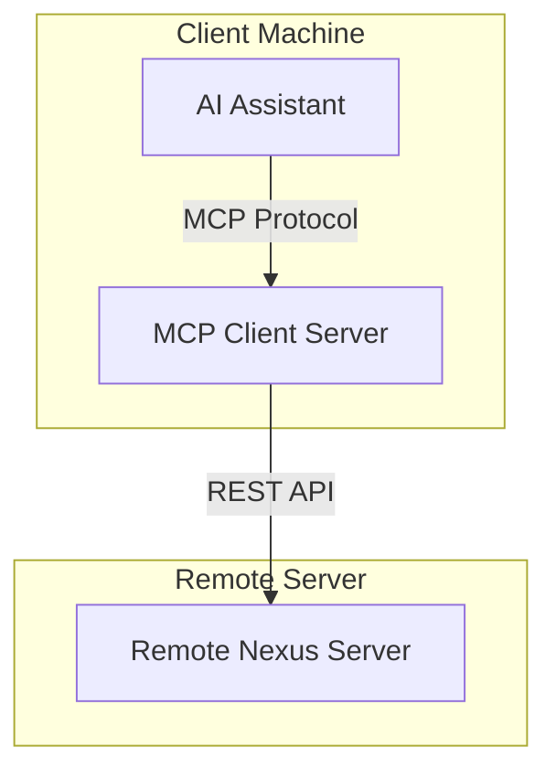

# Createve.AI Nexus MCP Client Server

## Overview

The Createve.AI Nexus MCP Client Server is a standalone TypeScript implementation that connects to the Createve.AI Nexus Server's REST API and exposes its functionality through the Model Context Protocol (MCP).

This approach offers significant benefits over the integrated Python MCP server:

- **Local Execution**: Runs on the client machine, avoiding direct WebSocket connections to remote servers
- **API Abstraction**: Interacts with the remote Nexus server via REST APIs
- **Enhanced Security**: Keeps API keys local to the client machine
- **Consistent Interface**: Provides the same MCP capabilities as the built-in server

## Architecture

The MCP client server follows a clean, modular architecture:



### Key Components

1. **Configuration Manager**: Handles environment variables and command-line arguments
2. **Nexus API Client**: Communicates with the remote Nexus server via REST
3. **Tool Registry**: Dynamically creates MCP tools from OpenAPI schema
4. **Resource Registry**: Provides access to documentation, queue status, and schema
5. **Schema Converter**: Converts OpenAPI schemas to Zod schemas for validation

## Installation and Setup

### Prerequisites

- Node.js 18.0.0 or higher
- Access to a Createve.AI Nexus Server instance

### Installation

1. The MCP client server is included with the Createve.AI Nexus Server in the `src/mcp_server` directory:

```bash
# Navigate to the MCP server directory
cd /path/to/createveai-nexus-server/src/mcp_server

# Install dependencies
npm install

# Build the project
npm run build
```

### Configuration

The MCP client server can be configured using environment variables or command-line arguments:

#### Environment Variables

- `CREATEVEAI_NEXUS_BASE_URL`: The base URL of the Nexus server (required)
- `CREATEVEAI_NEXUS_API_KEY`: API key for authentication (required)
- `CREATEVEAI_NEXUS_API`: Optional API filter to limit exposed endpoints
- `DEBUG`: Set to "createveai-nexus-mcp" to enable debug logging

#### Command-Line Arguments

- `--base-url <URL>`: The base URL of the Nexus server
- `--api-key <KEY>`: API key for authentication
- `--api <FILTER>`: Optional API filter
- `--debug`: Enable debug logging

## Integration with AI Assistants

### Claude Integration

Add the MCP server to your Claude environment by modifying `claude_desktop_config.json`:

```json
{
  "mcpServers": {
    "createveai-nexus": {
      "command": "node",
      "args": ["/path/to/createveai-nexus-server/src/mcp_server/build/index.js"],
      "env": {
        "CREATEVEAI_NEXUS_BASE_URL": "https://nexus.createve.ai",
        "CREATEVEAI_NEXUS_API_KEY": "your-api-key-here"
      },
      "disabled": false,
      "autoApprove": []
    }
  }
}
```

### GPT Integration

Add the MCP server to your OpenAI GPT configuration by using the following settings:

```json
{
  "tool_servers": [
    {
      "name": "createveai-nexus",
      "command": ["node", "/path/to/createveai-nexus-server/src/mcp_server/build/index.js"],
      "env": {
        "CREATEVEAI_NEXUS_BASE_URL": "https://nexus.createve.ai",
        "CREATEVEAI_NEXUS_API_KEY": "your-api-key-here"
      }
    }
  ]
}
```

### Anthropic Claude Pro Integration

Add the MCP server to your Claude Pro configuration:

```json
{
  "mcp": {
    "servers": [
      {
        "name": "createveai-nexus",
        "exec": {
          "command": "node",
          "args": ["/path/to/createveai-nexus-server/src/mcp_server/build/index.js"],
          "env": {
            "CREATEVEAI_NEXUS_BASE_URL": "https://nexus.createve.ai",
            "CREATEVEAI_NEXUS_API_KEY": "your-api-key-here"
          }
        }
      }
    ]
  }
}
```

## Available Features

### Resources

The MCP client server exposes these resources:

- `queue://{queueId}`: Status and result for a queued request
- `schema://openapi`: OpenAPI schema for all available APIs
- `schema://{api}`: OpenAPI schema for a specific API (when using API filter)
- `docs://readme`: Server documentation
- `docs://{path}`: Specific documentation resource

### Tools

The MCP client server dynamically creates tools based on the API endpoints available on the Nexus server. These tools follow the naming convention of the API paths with slashes replaced by underscores.

For example, an API endpoint at `/api/text_processing/analyze` would be available as the MCP tool `text_processing_analyze`.

## LLM Optimization Features

The MCP client server includes several features specifically designed to enhance LLM interaction:

1. **Rich Type Information**: Zod schemas provide detailed type information and validation
2. **Contextual Hints**: Response formatting includes guidance for follow-up actions
3. **Multi-step Support**: Queue resources are linked in tool responses for easy follow-up
4. **Error Recovery**: Clear error messages with suggested recovery paths
5. **Formatted Responses**: Responses are structured for optimal LLM consumption

## Comparison with Built-in MCP Server

| Feature | MCP Client Server | Built-in MCP Server |
|---------|-------------------|---------------------|
| Connection Type | REST API | WebSocket |
| Execution Location | Client Machine | Remote Server |
| API Key Storage | Client Side | Server Side |
| API Discovery | Dynamic (OpenAPI) | Dynamic (Python) |
| Resource Templates | Yes | Yes |
| Tool Generation | Yes | Yes |
| Queue Support | Yes | Yes |
| Documentation Access | Yes | Yes |
| Schema Access | Yes | Yes |

## Troubleshooting

### Common Issues

1. **Connection Errors**: Ensure the Nexus server URL is correct and accessible
2. **Authentication Errors**: Verify your API key is valid
3. **Missing Tools**: Check if the API filter is too restrictive
4. **Schema Errors**: Ensure the Nexus server is properly configured with OpenAPI schema

### Debugging

Enable debug logging by setting the environment variable:

```bash
DEBUG=createveai-nexus-mcp* node /path/to/createveai-nexus-server/src/mcp_server/build/index.js
```

Or use the `--debug` command-line flag.

## Development

For developers who want to extend or modify the MCP client server:

1. The codebase is written in TypeScript with a focus on modularity
2. New features should be added as separate modules in the appropriate directory
3. All API interactions should go through the NexusClient
4. Follow the existing patterns for error handling and response formatting
5. Use Zod for all schema validation

### Project Structure

```
src/mcp_server/
├── package.json               # Node.js package configuration
├── tsconfig.json              # TypeScript configuration
├── src/
│   ├── index.ts               # Entry point
│   ├── config.ts              # Configuration management
│   ├── nexus-client.ts        # REST API client
│   ├── tools/                 # Tool implementation
│   │   └── index.ts           # Tool registration
│   ├── resources/             # Resource implementation
│   │   └── index.ts           # Resource registration
│   └── utils/                 # Utility functions
│       └── schema-converter.ts # OpenAPI to Zod schema converter
```

## License

This project is licensed under the same Apache License 2.0 as the main Createve.AI Nexus Server.
