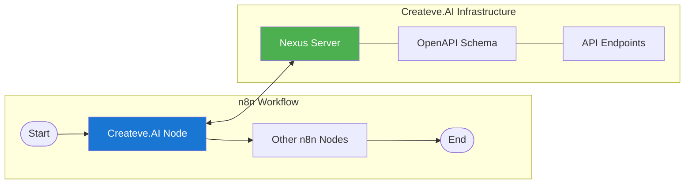
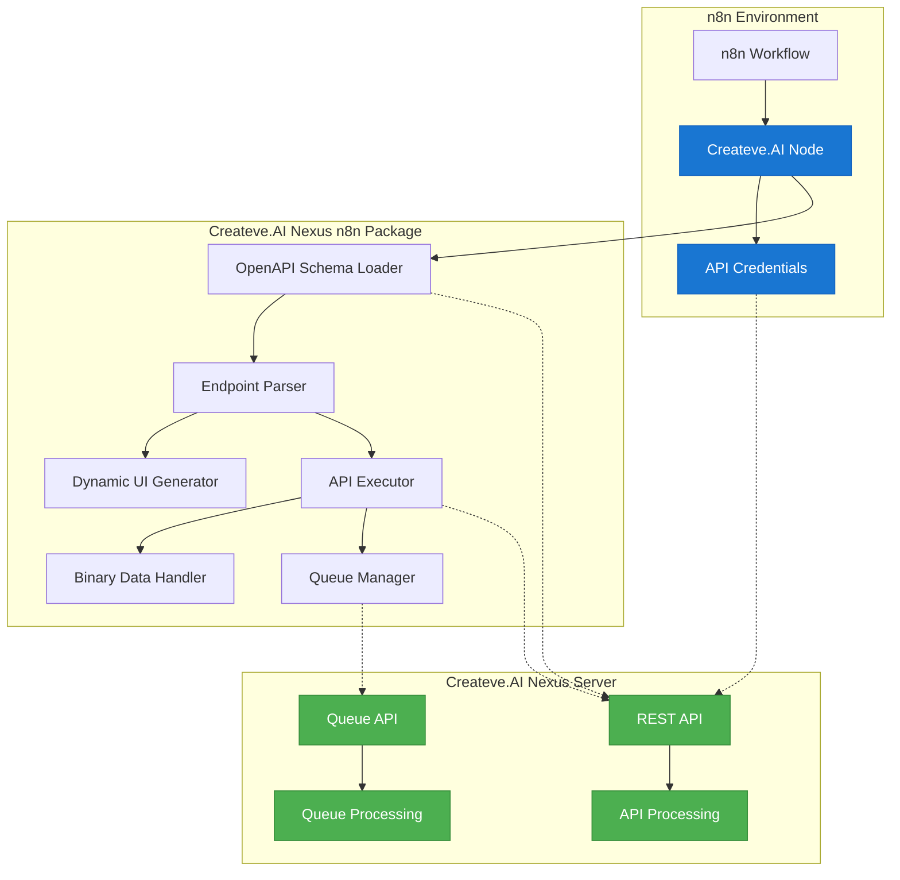
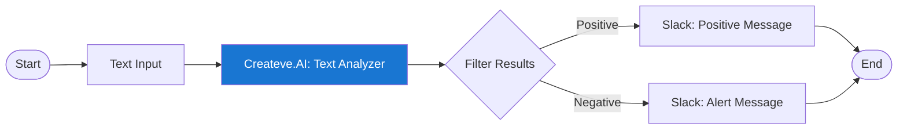
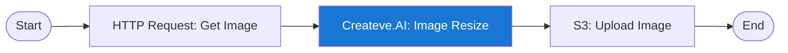
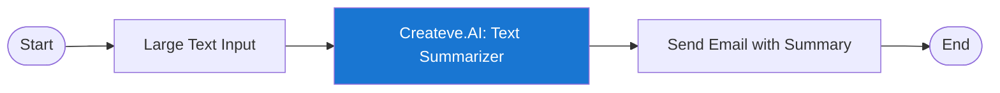

# Createve.AI Nexus n8n Nodes

This document provides comprehensive information about the Createve.AI Nexus n8n integration.

## Overview

The Createve.AI Nexus n8n Nodes package provides a seamless integration between [n8n](https://n8n.io/) - a powerful workflow automation tool - and the Createve.AI Nexus Server. This integration enables you to incorporate Nexus API capabilities into your automated workflows.

The package is designed with flexibility in mind, automatically discovering available API endpoints from your Nexus server's OpenAPI schema, which means it adapts to changes in your API without requiring code updates.



## Architecture

The n8n nodes integration follows a dynamic, schema-driven architecture:



## Key Components

1. **Createve.AI Node**: The main n8n node that integrates with the Createve.AI Nexus Server
2. **Credential Management**: Securely stores API connection details
3. **OpenAPI Schema Parsing**: Automatically discovers available endpoints and their parameters
4. **Dynamic UI**: Creates appropriate input fields based on the API schema
5. **Binary Data Handling**: Automatically processes images and files
6. **Queue Management**: Supports both direct and long-running queue-based operations

## Installation

### Prerequisites

- n8n version 0.214.0 or higher
- Access to a running Createve.AI Nexus Server

### Installation Steps

Install the package in your n8n environment:

```bash
npm install @createveai/n8n-nodes-nexus-openapi
```

For manual installation in a self-hosted n8n instance:

1. Download the package:
   ```bash
   cd /YOUR_N8N_DIRECTORY
   npm install @createveai/n8n-nodes-nexus-openapi
   ```

2. Restart your n8n instance to load the new nodes.

## Configuration

### Credential Setup

1. In n8n, go to **Settings** > **Credentials** > **New Credentials**
2. Select **Createve.AI API**
3. Enter the following information:
   - **API URL**: The URL of your Nexus server (e.g., `http://localhost:43080`)
   - **API Key**: Your API key for authentication
   - **Schema Path**: The path to the OpenAPI schema (default: `/openapi.json`)
4. Click **Save**

### Using the Node

1. In your workflow, add a new node and search for "Createve.AI"
2. Select the **Createve.AI** node
3. Choose the credentials you created
4. Select an **Endpoint** from the dropdown list (automatically fetched from your server)
5. Fill in the required parameters for the selected endpoint
6. Configure operation mode settings for queue-based operations if applicable

## Endpoint Types

The Createve.AI node supports two types of endpoints:

### Direct Endpoints

Direct endpoints process requests synchronously and return results immediately. Use these for operations that complete quickly (typically under 2 seconds).

### Queue-Based Endpoints

Queue-based endpoints are designed for long-running operations:

1. **Submit & Wait for Result**: Submit the job and wait for completion (the node handles polling)
2. **Submit Only**: Submit the job and return the queue ID immediately
3. **Check Status**: Check the status of a previously submitted job

Queue-based settings allow configuration of:
- **Max Poll Time**: Maximum time to wait for results (in seconds)
- **Poll Interval**: Time between status checks (in seconds)

## Binary Data Support

The node includes built-in support for handling binary data (images, videos, files):

- **Input**: Binary data from previous nodes is automatically processed
- **Output**: Binary data in responses is converted to n8n binary format

This allows seamless integration with n8n's file handling capabilities.

## Example Workflows

### Text Analysis



### Image Processing



### Long-Running Operation



## Troubleshooting

### Common Issues

1. **Connection Error**: Verify the API URL and ensure the Nexus server is running
2. **Authentication Error**: Check that your API key is correct and active
3. **No Endpoints Listed**: Ensure your server is properly exposing the OpenAPI schema
4. **Binary Data Issues**: Make sure binary data is in a compatible format

### Debug Mode

For detailed logging, enable debug mode in n8n:

```bash
export N8N_LOG_LEVEL=debug
```

## Development and Contribution

The n8n nodes package is open-source and available on GitHub. Contributions are welcome!

- **Source Code**: [GitHub Repository](https://github.com/spgoodman/createveai-nexus-server)
- **Issues**: Please report any issues on the GitHub repository

### Building from Source

```bash
git clone https://github.com/spgoodman/createveai-nexus-server.git
cd createveai-nexus-server/src/n8n_nodes
npm install
npm run build
```

### Publishing Process

The package is automatically published to npm when a new GitHub release is created:

1. Create a GitHub release with a semantic version tag (e.g., v1.0.0)
2. The GitHub Actions workflow will:
   - Validate the build
   - Extract the version from the tag
   - Publish the package to npm

## License

This project is licensed under the Apache License 2.0 - see the LICENSE file for details.
